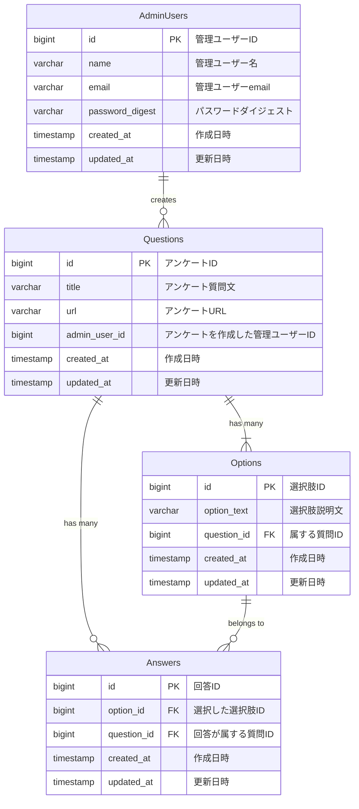

# 1問だけの選択式アンケートを作成し、URLを配布して回答を収集するシステム

## 使用技術
- バックエンド: NestJS, TypeScript, TypeORM, MySQL, GraphQL
- フロントエンド: Next.js

## 基本仕様

### 基本機能
- **ログインによるアクセス制御**: 管理画面にログインすることでアクセスを制限します。
- **アンケート作成**: 管理画面から単一選択式の質問を持つアンケートを作成可能です。
  - **質問構成**:
    - 1つの質問文
    - 1個以上の選択肢
- **回答URLの発行**: アンケート作成時に回答用のURLを発行
- **回答画面**:
  - URLにアクセスするとアンケートが表示されます
  - ユーザーは選択肢から1つを選んで回答可能です
- **集計結果の表示**:
  - 回答状況を選択肢ごとの回答者数および%で棒グラフに表示します。

### URL, ドメイン設計
| URL                  | 説明                                                             |
|----------------------|------------------------------------------------------------------|
| `/`                  | アンケート一覧画面。ログインしているユーザーに紐づくアンケートを表示。 |
| `/question`          | アンケート作成画面。作成時にログインしているユーザーのIDを付与。   |
| `/question/:url`     | アンケート回答画面。URL(パスパラメータ)に紐づくアンケート表示。任意の回答者(ログイン不要)がアンケートに答えることができる。 |
| `/answer`            | アンケートの結果一覧。ログインしているユーザーが作成したアンケートの結果をグラフ形式で表示。 |

### 認証ロジック

#### ユーザー作成
##### ユーザー情報の入力
- ユーザーから以下の情報を受け取ります：
  - `name`: ユーザー名
  - `email`: ユーザーのメールアドレス
  - `password`: ユーザーのパスワード

##### サーバーでの処理
1. 受け取ったユーザー情報を`UserService`に渡しす
2. パスワードを以下の手順で処理：
   - bcryptを使用してパスワードをハッシュ化
   - ハッシュ化したパスワードを`password_digest`として保存
3. ユーザー情報をデータベースに保存し、成功メッセージを返却
  - メールアドレスが既に存在する場合は、エラーメッセージを返却

---

#### ログイン
##### リダイレクト処理
- 未ログイン状態の場合`/`,`/question`,`/answer`にアクセスした場合、`/login`にリダイレクトされる

##### ログイン情報の入力
- 管理者ユーザーに以下の情報を入力させる：
  - `email`: ユーザーのメールアドレス
  - `password`: ユーザーのパスワード

##### 認証処理
- `AuthService`で以下の処理を行う：
  1. 入力されたメールアドレスを使用してユーザーを検索。
  2. ユーザーが見つかった場合、bcryptを使ってパスワードを比較
  3. 検証に成功した場合、JWTを生成し、クライアントに返却
  4. クライアントは受け取ったJWTをローカルストレージに保存する
    - ローカルストレージにJWTが保存されている
  5. 検証に成功した場合、ユーザーを`/`にリダイレクトし、作成したアンケートの一覧を表示
    - 検証に失敗した場合、「無効なメールアドレスまたはパスワード」というエラーメッセージを表示

## Query, Mutation仕様

### Queries

| Query                | Description                                            | Input Type        | Output Type       |
|----------------------|-------------------------------------------------------|--------------------|--------------------|
| `questionByUrl`      | 指定したURLに基づいてアンケートを取得             | `url: String!`     | `Question!`        |
| `questions`          | 指定された管理者ユーザーの質問リストを取得     | `adminUserId: Int!`| `[Question!]!`     |
| `questionResults`    | 管理者ユーザーによって作成された質問の結果を取得| `adminUserId: Int!`| `[QuestionWithAnswerCounts!]!` |

### Input/Output仕様

##### **`questionByUrl`**
- **Input**:
  - `url` (String!): アンケートURL
- **Output**:
  - `Question!`:
    - `id` (ID!): アンケートID
    - `title` (String!): アンケートタイトル
    - `url` (String!): アンケートURL
    - `admin_user` (AdminUser!): アンケートを作成した管理者ユーザー
    - `options` ([Option!]!): アンケートの持つ選択肢
    - `created_at` (DateTime!): 作成日時
    - `updated_at` (DateTime!): 更新日時

##### `questions`
- **Input**:
  - `adminUserId` (Int!): 管理者ユーザーID
- **Output**:
  - `[Question!]!`:
    - `id` (ID!): アンケートID
    - `title` (String!): アンケートタイトル
    - `url` (String!): アンケートURL
    - `created_at` (DateTime!): 作成日時
    - `updated_at` (DateTime!): 更新日時

##### `questionResults`
- **Input**:
  - `adminUserId` (Int!): 管理者ユーザーID
- **Output**:
  - `[QuestionWithAnswerCounts!]!`:
    - `questionId` (Int!): アンケートID
    - `title` (String!): アンケートタイトル
    - `options` ([AnswerCount!]!):
      - `option_id` (Int!): 選択肢ID
      - `option_text` (String!): 選択肢テキスト
      - `count` (Int!): 選択肢の回答数

---

### Mutations

| Mutation                     | Description                                     | Input Type                                            | Output Type                    |
|------------------------------|------------------------------------------------|------------------------------------------------------|---------------------------------|
| `registerAdminUser`          | 管理者ユーザーの登録                  | `registerAdminUserInput: RegisterAdminUserInput!`  | `RegisterAdminUserOutput!`     |
| `submitQuestion`             | アンケートを作成                             | `submitQuestionInput: SubmitQuestionInput!, adminUserId: Int!` | `SubmitQuestionOutput!`        |
| `submitAnswer`               | 回答を提出する。                             | `submitAnswerInput: SubmitAnswerInput!`            | `SubmitAnswerOutput!`          |
| `authenticateAdminUser`      | 管理者ユーザーの認証                 | `authenticateAdminUserInput: AuthenticateAdminUserInput!` | `AuthResponse!`                |

#### Input/Output Specifications

##### `registerAdminUser`
- **Input**:
  - `registerAdminUserInput` (RegisterAdminUserInput!):
    - `name` (String!): 管理者ユーザー名
    - `email` (String!): 管理者ユーザーのメールアドレス
    - `password` (String!): 管理者ユーザーの作成したパスワード
- **Output**:
  - `RegisterAdminUserOutput!`:
    - `success` (Boolean!): 成功したかをBooleanで返す
    - `statusCode` (Float!): HTTPステータスコード(ハンドリングしやすいよう明示的に作りました)
    - `errorMessage` (String, nullable): エラーメッセージ
    - `user` (AdminUser, nullable):
      - `id` (ID!): 管理者ユーザーID。
      - `name` (String!): 管理者ユーザー名
      - `email` (String!): 管理者ユーザーのメールアドレス
      - `created_at` (DateTime!): 作成日時
      - `updated_at` (DateTime!): 更新日時

##### `submitQuestion`
- **Input**:
  - `submitQuestionInput` (SubmitQuestionInput!):
    - `title` (String!): アンケートタイトル
    - `options` ([SubmitOptionInput!]!):
      - `SubmitOptionInput`:
        - `option_text` (String!): 選択肢のテキスト。
  - `adminUserId` (Int!): 管理者ユーザーID。
- **Output**:
  - `SubmitQuestionOutput!`:
    - `success` (Boolean!): 成功したかをBooleanで返す
    - `statusCode` (Float!): HTTPステータスコード(ハンドリングしやすいよう明示的に作りました)
    - `errorMessage` (String, nullable): エラーメッセージ
    - `question` (Question, nullable):
      - `id` (ID!): アンケートID
      - `title` (String!): アンケートタイトル
      - `url` (String!): アンケートURL
      - `admin_user` (AdminUser!): アンケートを作成した管理者ユーザー
      - `options` ([Option!]!): 質問の選択肢
      - `created_at` (DateTime!): 作成日時
      - `updated_at` (DateTime!): 更新日時

##### `submitAnswer`
- **Input**:
  - `submitAnswerInput` (SubmitAnswerInput!):
    - `option_id` (Int!): 選択肢ID
    - `question_id` (Int!): アンケートID
- **Output**:
  - `SubmitAnswerOutput!`:
    - `success` (Boolean!): 成功したかをBooleanで返す
    - `statusCode` (Float!): HTTPステータスコード(ハンドリングしやすいよう明示的に作りました)
    - `errorMessage` (String, nullable): エラーメッセージ
    - `answer` (Answer): 回答
      - `id` (ID!): 回答ID
      - `question` (Question!): 回答したアンケート
      - `option` (Option!): 選択した選択肢

##### `authenticateAdminUser`
- **Input**:
  - `authenticateAdminUserInput` (AuthenticateAdminUserInput!):
    - `email` (String!): 管理者ユーザーのメールアドレス
    - `password` (String!): 管理者ユーザーの作成したパスワード
- **Output**:
  - `AuthResponse!`:
    - `access_token` (String!): 認証トークン

## DB設計, ER図

### `admin_users` テーブル

| Field           | Type         | Null | Key | Default              | Extra                                            |
|-----------------|--------------|------|-----|----------------------|--------------------------------------------------|
| admin_user_id   | int          | NO   | PRI | NULL                 | auto_increment                                   |
| name            | varchar(20)  | YES  |     | NULL                 |                                                  |
| email           | varchar(255) | NO   |     | NULL                 |                                                  |
| password_digest | varchar(255) | YES  |     | NULL                 |                                                  |
| created_at      | datetime(6)  | NO   |     | CURRENT_TIMESTAMP(6) | DEFAULT_GENERATED                                |
| updated_at      | datetime(6)  | NO   |     | CURRENT_TIMESTAMP(6) | DEFAULT_GENERATED on update CURRENT_TIMESTAMP(6) |

### `answers` テーブル

| Field       | Type        | Null | Key | Default              | Extra                                            |
|-------------|-------------|------|-----|----------------------|--------------------------------------------------|
| answer_id   | int         | NO   | PRI | NULL                 | auto_increment                                   |
| option_id   | int         | NO   | MUL | NULL                 |                                                  |
| question_id | int         | NO   | MUL | NULL                 |                                                  |
| created_at  | datetime(6) | NO   |     | CURRENT_TIMESTAMP(6) | DEFAULT_GENERATED                                |
| updated_at  | datetime(6) | NO   |     | CURRENT_TIMESTAMP(6) | DEFAULT_GENERATED on update CURRENT_TIMESTAMP(6) |

### `options` テーブル

| Field         | Type         | Null | Key | Default              | Extra                                            |
|---------------|--------------|------|-----|----------------------|--------------------------------------------------|
| option_id     | int          | NO   | PRI | NULL                 | auto_increment                                   |
| option_text   | varchar(255) | YES  |     | NULL                 |                                                  |
| created_at    | datetime(6)  | NO   |     | CURRENT_TIMESTAMP(6) | DEFAULT_GENERATED                                |
| updated_at    | datetime(6)  | NO   |     | CURRENT_TIMESTAMP(6) | DEFAULT_GENERATED on update CURRENT_TIMESTAMP(6) |
| question_id   | int          | YES  | MUL | NULL                 |                                                  |

### `questions` テーブル

| Field         | Type         | Null | Key | Default              | Extra                                            |
|---------------|--------------|------|-----|----------------------|--------------------------------------------------|
| question_id   | int          | NO   | PRI | NULL                 | auto_increment                                   |
| title         | varchar(255) | YES  |     | NULL                 |                                                  |
| url           | varchar(255) | NO   |     | NULL                 |                                                  |
| created_at    | datetime(6)  | NO   |     | CURRENT_TIMESTAMP(6) | DEFAULT_GENERATED                                |
| updated_at    | datetime(6)  | NO   |     | CURRENT_TIMESTAMP(6) | DEFAULT_GENERATED on update CURRENT_TIMESTAMP(6) |
| admin_user_id | int          | YES  | MUL | NULL                 |                                                  |
