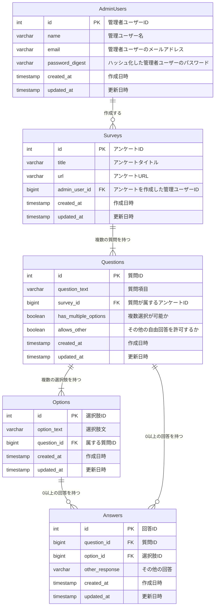

# 概要
アンケートを作成し、URLを配布して回答を収集するシステム

## 使用技術
- サーバーサイド: NestJS, TypeScript, TypeORM, MySQL, GraphQL
- クライアントサイド: Next.js, React, TypeScript, Material UI, react-chartjs-2

## 基本機能
- **ログインによるアクセス制御**: 管理画面にログインすることでアクセスを制限
- **アンケート作成**: 管理画面からアンケートを作成できる
  - **質問構成**:
    - 1つの質問文
    - 1個以上の選択肢
    - 複数の選択肢による回答が可能な質問を作成可能
    - 任意のテキストによる選択肢を作成可能
- **回答URLの発行**: アンケート作成時に回答用のURLを発行
- **回答画面**:
  - URLにアクセスするとアンケートが表示されます
  - ユーザーは選択肢から1つ or 複数 or 任意のテキスト による回答で回答可能です
- **集計結果の表示**:
  - 回答状況を選択肢ごとの回答者数を棒グラフに表示

## URL, ドメイン設計
| URL                  | 説明                                                             |
|----------------------|------------------------------------------------------------------|
| `/`                  | アンケート一覧画面。ログインしているユーザーに紐づくアンケートを表示。 |
| `/survey`          | アンケート作成画面。作成時にログインしているユーザーのIDを付与。   |
| `/survey/:url`     | アンケート回答画面。URL(パスパラメータ)に紐づくアンケート表示。任意の回答者(ログイン不要)がアンケートに答えることができる。 |
| `/answer/:url`            | アンケート結果画面。URL(パスパラメータ)に紐づくアンケートの結果をグラフ形式で表示。 |

## 認証ロジック
### ユーザー作成
#### ユーザー情報の入力
- ユーザーから以下の情報を受け取ります：
  - `name`: ユーザー名
  - `email`: ユーザーのメールアドレス
  - `password`: ユーザーのパスワード

#### サーバーでの処理
1. 受け取ったユーザー情報を`UserService`に渡しす
2. パスワードを以下の手順で処理：
   - bcryptを使用してパスワードをハッシュ化
   - ハッシュ化したパスワードを`password_digest`として保存
3. ユーザー情報をデータベースに保存し、成功メッセージを返却
  - メールアドレスが既に存在する場合は、エラーメッセージを返却

---

### ログイン
#### リダイレクト処理
- 未ログイン状態の状態で`/`,`/survey`,`/answer/:url`にアクセスした場合、`/login`にリダイレクトされる

#### ログイン情報の入力
- 管理者ユーザーに以下の情報を入力させる：
  - `email`: ユーザーのメールアドレス
  - `password`: ユーザーのパスワード

#### 認証処理
1. クライアント側
  - ユーザーがページにアクセスするとuseAuthフックがlocalStorageから認証トークンを確認
  - クライアントは認証トークンを含むリクエスト(QueryやMutation)を送信する
2. サーバー側
  - JwtAuthGuardがリクエストのトークンを検証する
  - 認証が成功した場合、リクエスト内にAdminUserIdをセットし、各リゾルバ内で使用する 

### Queries

| Query                | Description                                            | Input Type        | Output Type       |
|----------------------|-------------------------------------------------------|--------------------|--------------------|
| `surveyByUrl`      | 指定したURLに基づいてアンケートを取得             | `url: String!`     | `Survey!`        |
| `surveys`          | 指定された管理者ユーザーの質問リストを取得     | NULL | `[Survey!]!`     |
| `surveyResult`    | 管理者ユーザーによって作成された質問の結果を取得| NULL | `SurveyResult!` |

---

### Input/Output仕様

#### **`surveyByUrl`**

| Input        | Type          | Description         |
|--------------|---------------|---------------------|
| `url`        | `String!`     | アンケートURL        |

| Output       | Type            | Description            |
|--------------|-----------------|------------------------|
| `id`         | `ID!`           | アンケートID            |
| `title`      | `String!`       | アンケートタイトル       |
| `url`        | `String!`       | アンケートURL           |
| `admin_user` | `AdminUser!`    | アンケートを作成した管理者ユーザー |
| `questions`  | `[Question!]!`  | アンケートの持つ質問    |
| `created_at` | `DateTime!`     | 作成日時                |
| `updated_at` | `DateTime!`     | 更新日時                |

---

#### **`surveys`**

| Output       | Type            | Description            |
|--------------|-----------------|------------------------|
| `id`         | `ID!`           | アンケートID            |
| `title`      | `String!`       | アンケートタイトル       |
| `url`        | `String!`       | アンケートURL           |

---

#### **`surveyResult`**

| Input        | Type          | Description         |
|--------------|---------------|---------------------|
| `url`        | `String!`     | アンケートURL        |

| Output         | Type              | Description            |
|----------------|-------------------|------------------------|
| `surveyId`     | `String!`         | アンケートID            |
| `title`        | `String!`         | アンケートタイトル       |
| `questionResults` |                 | 質問とその回答          |
| `questionId`   | `Int!`            | 質問ID                  |
| `questionText` | `String!`         | 質問テキスト            |
| `otherCount`   | `Int!`            | 任意回答の数            |
| `otherResponses` | `[String!]`      | 任意回答の配列          |
| `answerCounts` |                   | 選択肢の回答数          |
| `optionId`     | `Int!`            | 選択肢のID              |
| `optionText`   | `String!`         | 選択肢のテキスト        |
| `count`        | `Int!`            | 選択肢の回答数          |

---

### Mutations

| Mutation                     | Description                                     | Input Type                                            | Output Type                    |
|------------------------------|------------------------------------------------|------------------------------------------------------|---------------------------------|
| `registerAdminUser`          | 管理者ユーザーの登録                  | `registerAdminUserInput: RegisterAdminUserInput!`  | `RegisterAdminUserOutput!`     |
| `submitSurvey`             | アンケートを作成                             | `submitSurveyInput: SubmitSurveyInput!` | `SubmitSurveyOutput!`        |
| `submitAnswer`               | アンケートに回答                             | `submitAnswerInput: SubmitAnswerInput!`            | `SubmitAnswerOutput!`          |
| `authenticateAdminUser`      | 管理者ユーザーの認証                 | `authenticateAdminUserInput: AuthenticateAdminUserInput!` | `AuthResponse!`                |

---

#### **`registerAdminUser`**

| Input                   | Type                  | Description                   |
|-------------------------|-----------------------|-------------------------------|
| `name`                  | `String!`             | 管理者ユーザー名              |
| `email`                 | `String!`             | 管理者ユーザーのメールアドレス |
| `password`              | `String!`             | パスワード                    |

| Output                  | Type                      | Description                   |
|-------------------------|---------------------------|-------------------------------|
| `success`               | `Boolean!`                | 成功したか                    |
| `errorMessage`          | `String`                  | エラーメッセージ              |
| `user`                  | `AdminUser`               | 登録されたユーザー情報         |

---

#### **`submitSurvey`**

| Input                   | Type                      | Description                   |
|-------------------------|---------------------------|-------------------------------|
| `title`                 | `String!`                 | アンケートタイトル             |
| `questions`             | `[SubmitQuestionInput!]!`  | 質問のリスト                   |
| `question_text`         | `String!`                 | 質問テキスト                   |
| `hasMultipleOptions`  | `Boolean!`                | 複数選択肢を許可するか         |
| `allowsOther`          | `Boolean!`                | その他の回答を許可するか       |
| `options`               | `[SubmitOptionInput!]!`    | 選択肢リスト                   |
| `optionText`           | `String!`                 | 選択肢のテキスト               |

| Output                  | Type                      | Description                   |
|-------------------------|---------------------------|-------------------------------|
| `success`               | `Boolean!`                | 成功したか                    |
| `errorMessage`          | `String`                  | エラーメッセージ              |
| `survey`                | `Survey`                  | 作成されたアンケート           |

---

#### **`submitAnswer`**

| Input                   | Type                      | Description                   |
|-------------------------|---------------------------|-------------------------------|
| `questionAnswers`       | `[SubmitQuestionAnswerInput!]!` | 質問ごとの回答リスト      |
| `questionId`            | `Int!`                    | 質問ID                         |
| `options`               | `[SubmitOptionAnswerInput!]!` | 選択されたオプションリスト   |
| `optionId`             | `Int!`                    | オプションID                   |
| `otherResponse`        | `String`                  | その他の回答                   |

| Output                  | Type                      | Description                   |
|-------------------------|---------------------------|-------------------------------|
| `success`               | `Boolean!`                | 成功したか                    |
| `errorMessage`          | `String`                  | エラーメッセージ              |
| `answer`                | `[Answer!]`               | 登録された回答                 |

## DB設計, ER図

