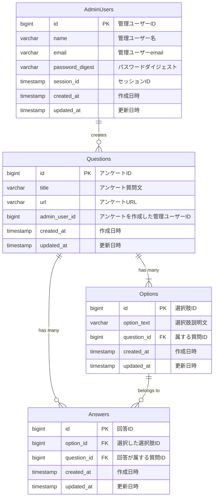

# 1問だけの選択式アンケートを作成し、URLを配布して回答を収集するシステム

## 使用技術
- バックエンド: NestJS, TypeScript, TypeORM, MySQL, GraphQL
- フロントエンド: Next.js

## 基本機能
- ログインによるアクセス制御: 管理画面にログインすることでアクセスを制限。
- アンケート作成: 管理画面から単一選択式の質問を持つアンケートを作成可能。
- 質問構成:
  - 1つの質問文
  - 1個以上の選択肢
- 回答URLの発行: アンケート作成時に回答用のURLを発行。
- 回答画面:
  - URLにアクセスするとアンケートが表示される。
  - ユーザーは選択肢から1つを選んで回答可能。
- 集計結果の表示:
  - 回答状況を選択肢ごとの回答者数および%で棒グラフに表示。

## DB設計, ER図

### `admin_users` テーブル

| Field           | Type         | Null | Key | Default              | Extra                                            |
|-----------------|--------------|------|-----|----------------------|--------------------------------------------------|
| admin_user_id   | int          | NO   | PRI | NULL                 | auto_increment                                   |
| name            | varchar(20)  | YES  |     | NULL                 |                                                  |
| email           | varchar(255) | NO  |     | NULL                 |                                                  |
| password_digest | varchar(255) | YES  |     | NULL                 |                                                  |
| session_id      | varchar(255) | YES  |     | NULL                 |                                                  |
| created_at      | datetime(6)  | NO   |     | CURRENT_TIMESTAMP(6) | DEFAULT_GENERATED                                |
| updated_at      | datetime(6)  | NO   |     | CURRENT_TIMESTAMP(6) | DEFAULT_GENERATED on update CURRENT_TIMESTAMP(6) |

### `answers` テーブル

| Field       | Type        | Null | Key | Default              | Extra                                            |
|-------------|-------------|------|-----|----------------------|--------------------------------------------------|
| answer_id   | int         | NO   | PRI | NULL                 | auto_increment                                   |
| option_id   | int         | NO   | MUL | NULL                 |                                                  |
| question_id | int         | NO   | MUL | NULL                 |                                                  |
| created_at  | datetime(6) | NO   |     | CURRENT_TIMESTAMP(6) | DEFAULT_GENERATED                                |
| updated_at  | datetime(6) | NO   |     | CURRENT_TIMESTAMP(6) | DEFAULT_GENERATED on update CURRENT_TIMESTAMP(6) |

### `options` テーブル

| Field         | Type         | Null | Key | Default              | Extra                                            |
|---------------|--------------|------|-----|----------------------|--------------------------------------------------|
| option_id     | int          | NO   | PRI | NULL                 | auto_increment                                   |
| option_text   | varchar(255) | YES  |     | NULL                 |                                                  |
| created_at    | datetime(6)  | NO   |     | CURRENT_TIMESTAMP(6) | DEFAULT_GENERATED                                |
| updated_at    | datetime(6)  | NO   |     | CURRENT_TIMESTAMP(6) | DEFAULT_GENERATED on update CURRENT_TIMESTAMP(6) |
| question_id   | int          | YES  | MUL | NULL                 |                                                  |

### `questions` テーブル

| Field         | Type         | Null | Key | Default              | Extra                                            |
|---------------|--------------|------|-----|----------------------|--------------------------------------------------|
| question_id   | int          | NO   | PRI | NULL                 | auto_increment                                   |
| title         | varchar(255) | YES  |     | NULL                 |                                                  |
| url           | varchar(255) | NO   |     | NULL                 |                                                  |
| created_at    | datetime(6)  | NO   |     | CURRENT_TIMESTAMP(6) | DEFAULT_GENERATED                                |
| updated_at    | datetime(6)  | NO   |     | CURRENT_TIMESTAMP(6) | DEFAULT_GENERATED on update CURRENT_TIMESTAMP(6) |
| admin_user_id | int          | YES  | MUL | NULL                 |                                                  |
