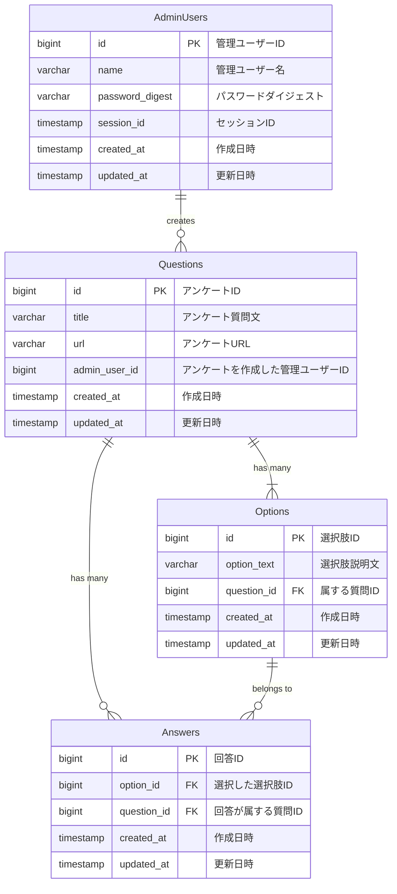

## 1問だけの選択式アンケートを作成し、URLを配布して回答を収集するシステム

### 使用技術
- バックエンド: NestJS, TypeScript, TypeORM, MySQL, GraphQL
- フロントエンド: Next.js

### 基本機能
- ログインによるアクセス制御: 管理画面にログインすることでアクセスを制限。
- アンケート作成: 管理画面から単一選択式の質問を持つアンケートを作成可能。
- 質問構成:
  - 1つの質問文
  - 1個以上の選択肢
- 回答URLの発行: アンケート作成時に回答用のURLを発行。
- 回答画面:
  - URLにアクセスするとアンケートが表示される。
  - ユーザーは選択肢から1つを選んで回答可能。
- 集計結果の表示:
  - 回答状況を選択肢ごとの回答者数および%で棒グラフに表示。

### DB設計, ER図

